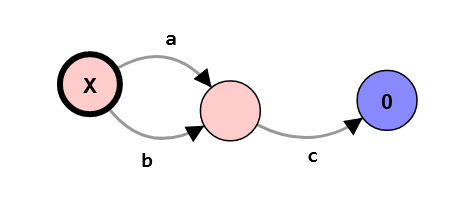

# Primeiro Trabalho Prático de **Programação Concorrente**

## Descrição 

Programa em **_Erlang_** para traduzir termos do **CCS0** (_deadlock_, prefixo e escolha não determinística) para o **_Labelled Transition System_** (**LTS**) correspondente.

- 1) (valorização: 2,5 valores) Escreva um tradutor que tem como input a **_Abstract Syntax Tree_** (**AST**) do termo **CCS0**.
Por exemplo, o termo a.0 + b.0 pode ser representado pela **AST** {_choice_ {_prefix_ 'a' zero} {_prefix_ 'b' zero}}.

- 2) (valorização: 1 valor) Use a função anterior para implementar um _server_ **_Erlang_** que recebe a **AST** de um termo **CCS0** e envia de volta ao cliente o **LTS** correspondente ao termo.

- 3) (valorização: 0,5 valores) Escreva um _parser_ que converte a _string_ correspondente ao termo **CCS0** na sua **AST**, e nesse caso envie a _string_ ao _server_. Pode implementar o _parser_ diretamente em **_Erlang_** ou utilizar um gerador de parsers (ex: https://www.erlang.org/doc/man/yecc.html).

## Exemplo

O termo a.c.0 + b.c.0 pode ser representado pela **_AST_** {choice, {prefix, "a", {prefix, "c", zero}}, {prefix, "b", {prefix, "c", zero}}}, que é corespondente ao seguinte LTS:
