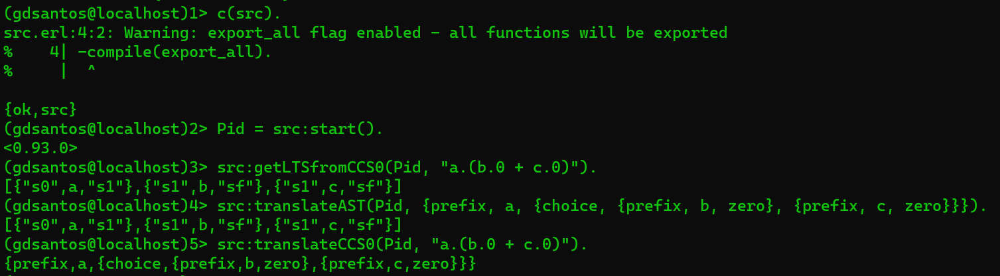

# First Practical Assignment - **Concurrent Programming**

## English

### Assignment 

Write a program in **_Erlang_** to translate terms from **CCS0** (_deadlock_, prefix and non-deterministic choice) to the corresponding **_Labelled Transition System_** (**LTS**).

### Example

The term **a.(b.0 + c.0)** can be represented by the **_AST_** **{_prefix_, 'a', {_choice_, {_prefix_, 'b', zero}, {_prefix_, 'c', zero}}}**, which corresponds to the **LTS** shown on image 1.

On the server file, the functions available are:

**getLTSfromCCS0**/2, which receives the _Pid_ and the _string_ describing a **CCS0** term, e returns the corresponding **LTS**;

**translateAST**/2, which receives the _Pid_ and the **AST** describing **CCS0**, e retorns the **LTS**;

**translateCCS0**/2, which receives the _Pid_ and a string corresponding to the **CCS0** term, and returns the **AST**.

Image 2 is a test run example for the program using all three functions:

## Português

### Descrição 

Programa em **_Erlang_** para traduzir termos do **CCS0** (_deadlock_, prefixo e escolha não determinística) para o **_Labelled Transition System_** (**LTS**) correspondente.

- 1) (valorização: 2,5 valores) Escreva um tradutor que tem como input a **_Abstract Syntax Tree_** (**AST**) do termo **CCS0**.
Por exemplo, o termo **a.0 + b.0** pode ser representado pela **AST** **{_choice_ {_prefix_ 'a' zero} {_prefix_ 'b' zero}}**.

- 2) (valorização: 1 valor) Use a função anterior para implementar um _server_ **_Erlang_** que recebe a **AST** de um termo **CCS0** e envia de volta ao cliente o **LTS** correspondente ao termo.

- 3) (valorização: 0,5 valores) Escreva um _parser_ que converte a _string_ correspondente ao termo **CCS0** na sua **AST**, e nesse caso envie a _string_ ao _server_. Pode implementar o _parser_ diretamente em **_Erlang_** ou utilizar um gerador de parsers (ex: https://www.erlang.org/doc/man/yecc.html).

### Exemplo

O termo **a.(b.0 + c.0)** pode ser representado pela **_AST_** **{_prefix_, 'a', {_choice_, {_prefix_, 'b', zero}, {_prefix_, 'c', zero}}}**, que é correspondente ao **LTS** da imagem 1.

No server, estão disponíveis as seguintes funções:

**getLTSfromCCS0**/2, que recebe como argumento o _Pid_ e a _string_ correspondente ao termo **CCS0**, e retorna o **LTS** correspondente;

**translateAST**/2, que recebe o _Pid_ e a **AST** correspondente ao termo **CCS0**, e retorna o **LTS**;

**translateCCS0**/2, que recebe o _Pid_ e uma string correspondente ao termo **CCS0**, e retorna a **AST**.

Na imagem 2, há um exemplo de teste do funcionamento do código para traduzir o termo CCS0 para um LTS, AST para LTS e CCS0 para ATS.

## Images

### Image 1

### Image 2

